# FXServer Installer

FXServer Installer is a Windows desktop app for setting up, configuring, and maintaining FiveM FXServer workspaces. It combines MariaDB setup, FXServer artifact management, config editing, RCON tools, logs, resource updates, and utility panels in one Tauri app.

The app is built with Svelte, TypeScript, Tauri, Tailwind CSS v4, shadcn-svelte, Vite, Rust, and npm.

Quick note: The main purpose of this app was for me to learn how to build with Tauri and hopefully create something useful along the way. I have really enjoyed making this project, and I hope it helps you too.

> [!WARNING]
> FXServer Installer is a new project in active development. Issues, bugs, UI changes, and breaking changes may happen between releases, so back up important server data before using app features that install, update, uninstall, or rewrite files.

> [!WARNING]
> **Version 0.4.0 is a beta, not a fully tested production release.** Automated checks do not replace live Windows Server, MariaDB upgrade/restore, or FXServer load testing. Test on a disposable server and keep independent backups. See the [0.4.0 beta release notes](docs/releases/v0.4.0.md) for changes and validation limits.

> [!NOTE]
> Windows SmartScreen may warn because this project is new and currently unsigned. If you downloaded it from the official GitHub Releases page, click "More info" and then "Run anyway".

## Screenshots

<p align="center">
  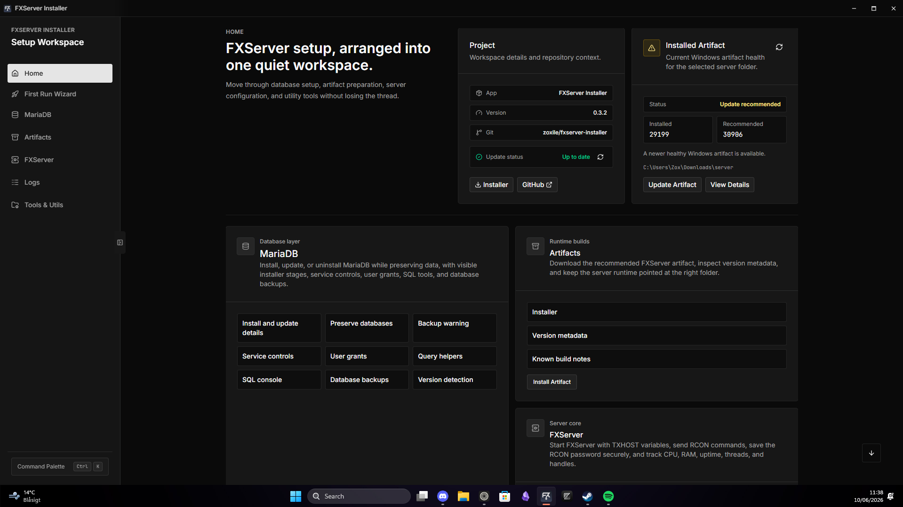
</p>

### First Run Experience

<p align="center">
  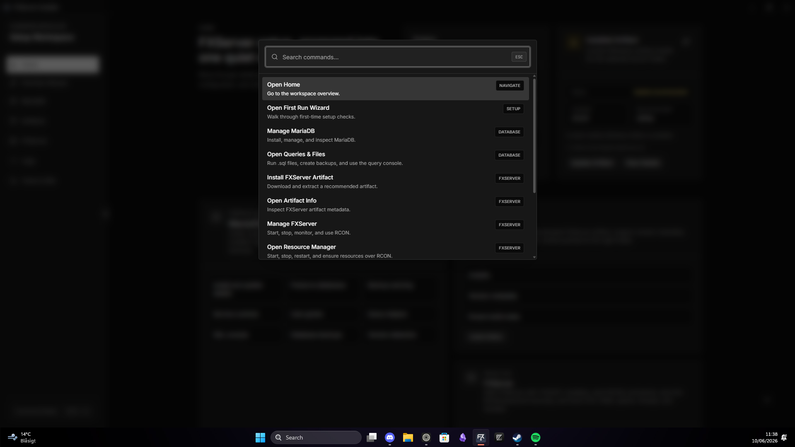
  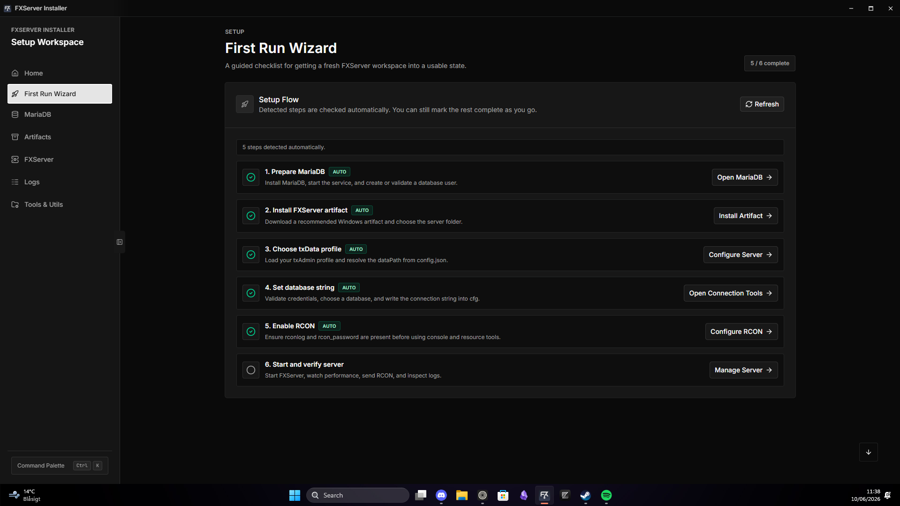
</p>

### Artifact Management

<p align="center">
  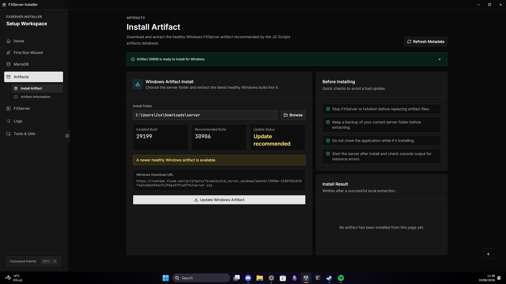
  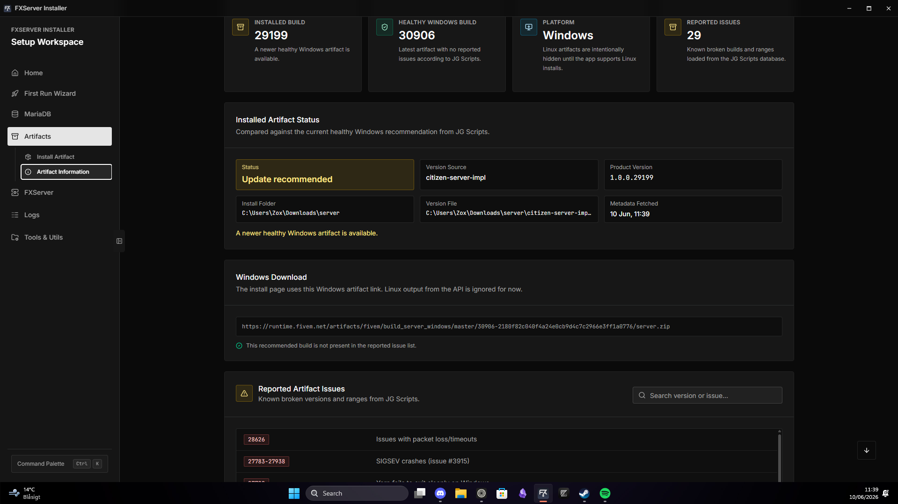
</p>

### Server Configuration

<p align="center">
  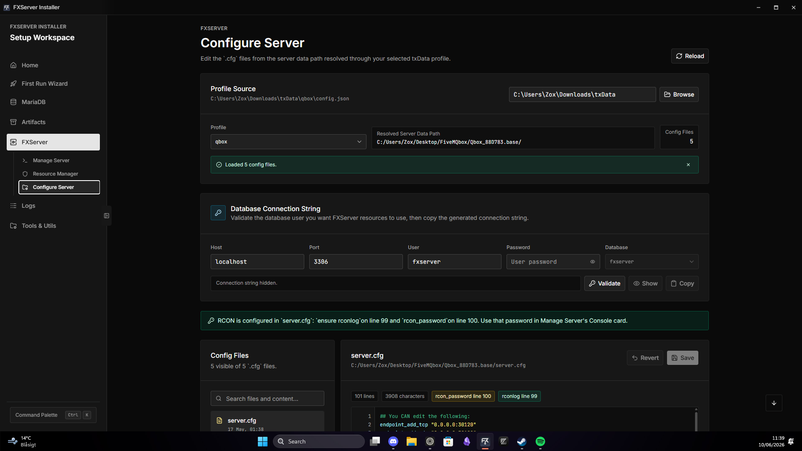
  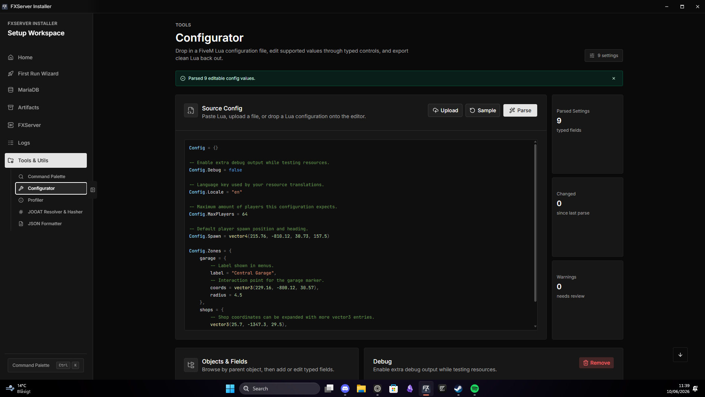
</p>

### MariaDB Management

<p align="center">
  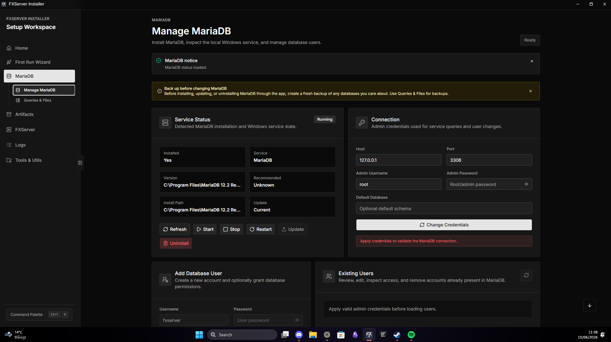
  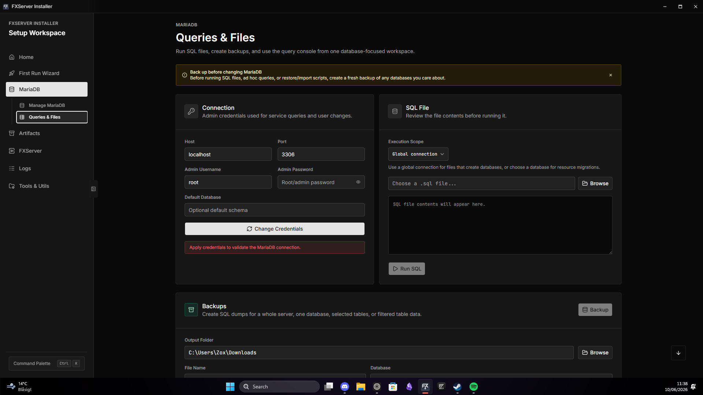
</p>

### Server Management

<p align="center">
  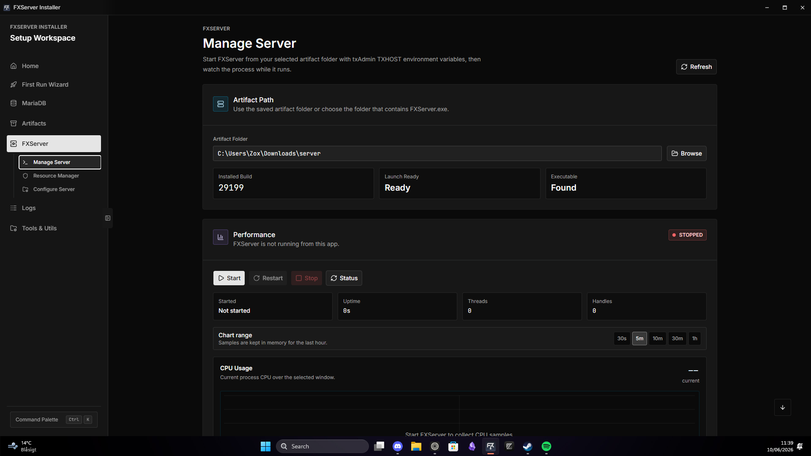
  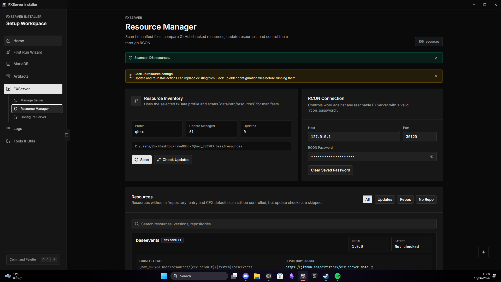
</p>

### Utilities & Logs

<p align="center">
  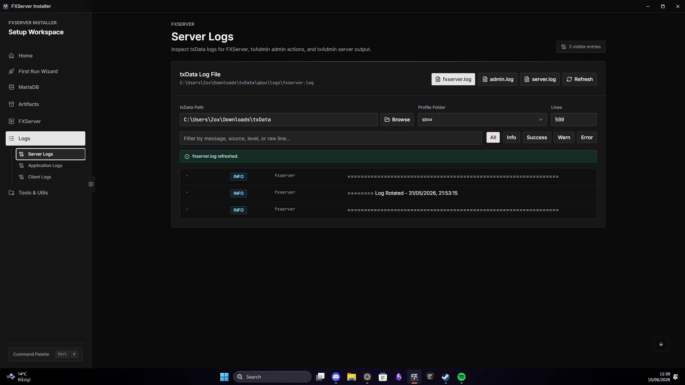
</p>

## Documentation

- [User Guide](docs/user-guide.md): Install, build, update, and operate the app without relying on the installer workflow.
- [Live Bridge](docs/live-bridge.md): Optional local pairing, real runtime data, installation, removal, and security limits.
- [Security Policy](SECURITY.md): Report vulnerabilities privately and review the application's trust boundaries.
- [JOOAT Resolver Pack](docs/jooat-resolver-pack.md): Build and host the optional offline JOOAT hash resolver database.
- [Contributing Guide](CONTRIBUTING.md): How to report issues, open pull requests, and write conventional commits.

## Features

### Home And Onboarding

- Dashboard cards for the main app areas.
- First Run Wizard that checks setup status and auto-completes steps when MariaDB, artifacts, and FXServer data are already available.
- Command palette shortcut hint in the sidebar.

### Workspaces And Background Tasks

- Separate saved artifact paths, txAdmin profiles, environment settings, and database defaults.
- Per-workspace encrypted RCON passwords; database passwords remain session-only.
- One active server at a time, with guarded workspace switching.
- Task Center with running operations and bounded session history, available from the sidebar.
- Private clone, export, and import previews for selected resources and sanitized configuration, with a new destination and reviewed ports.
- Optional constrained SQL dump migration into a newly created, app-owned database, never an existing target database. Packages remain local and require permission to copy their contents.

### Backups, Diagnostics, And Health

- Opt-in scheduled database backups while the app is open or in the tray, with retention and disk-space checks.
- Verified restore previews, explicit database confirmation, and a recovery backup before restoring.
- Separate restore tests in an isolated temporary database, with checksum and SQL preflight, saved outcomes, and ownership-checked cleanup.
- Preflight checks before starting or restarting, including paths, resources, dependencies, RCON, and optional database validation.
- Guided repair steps and a narrowly scoped, reviewed `ensure rconlog` configuration patch when the scan is unambiguous.
- Previewable, redacted diagnostic ZIP exports.
- Opt-in CPU, RAM, and disk alerts, with bounded crash recovery and backoff.

### Manage MariaDB

- Detect MariaDB installation and service status.
- Install, update, and uninstall MariaDB while preserving database data.
- Show installed and recommended versions.
- Show installer progress and important messages in the UI.
- Log MariaDB operations to Application Logs.
- Manage users, hosts, privileges, and database access.
- Warn users to back up databases before install, update, or uninstall actions.

### Queries & Files

- Shared MariaDB connection card with the Manage MariaDB panel.
- Query console with helper snippets for common SELECT, filter, update, delete, and schema tasks.
- SQL file runner with global or database-scoped execution.
- Backup tools for full, database, and table-level exports.

### Database Browser

- Read-only-by-default table browsing, column and index metadata, pagination, sorting, filters, and bounded CSV export.
- Explicitly enabled single-row insert, update, and delete previews for supported InnoDB tables.
- Exact table confirmation, short-lived previews, schema and row-change guards, and rollback unless exactly one row is affected. Tables with unsupported types or unverifiable side effects remain read-only.

### Artifacts

- Keep the existing recommended-install workflow using [JG Scripts Artifacts DB](https://artifacts.jgscripts.com/).
- Browse other [official Windows FXServer builds](https://runtime.fivem.net/artifacts/fivem/build_server_windows/master/) with search, health filters, pagination, cached metadata, and refresh.
- See current/recommended markers and red known-issue badges; explicitly acknowledge reported or unknown risks before installing a selected build.
- Treat missing or stale issue information as unknown, not healthy. Artifact replacement is not a version-switch or rollback system.
- Track configured artifact paths inside the app.

### Configure Server

- Read txAdmin profile data from `txData/{profile}/config.json`.
- Resolve the server `dataPath` from the profile configuration.
- Load and edit common `.cfg` files such as `server.cfg`, `permissions.cfg`, `voice.cfg`, `ox.cfg`, and `misc.cfg`.
- Colored `.cfg` editor with line numbers, save, undo, and keyboard shortcuts.
- Helpers for common `server.cfg` values, RCON setup, database connection strings, and permissions.
- Highlight `rcon_password` and warn when `ensure rconlog` is missing.
- Bounded, Windows-encrypted per-file configuration history with explicit secret reveal, diffs, and reviewed restore while the managed server is stopped.

### Manage Server

- Start, stop, restart, and check FXServer status without blocking navigation.
- Optimized console output for busy servers.
- Send RCON commands with a saved RCON password protected by Windows data protection.
- CPU and RAM performance charts with selectable time ranges.
- Uptime, started time, thread count, and handle count in the Performance card.

### Optional Live Bridge

- Off by default; install and pair a small server-only resource from **FXServer > Live Bridge**.
- Only loopback requests with the paired Bearer token are accepted. The server token stays in a server-only file; the app pairing is protected with Windows DPAPI.
- Read real resource states and versions, player server IDs/names/ping, server information, recent resource events, bridge uptime, and scheduler delay.
- Allow only resource `start`, `stop`, `restart`, and `ensure` actions, not arbitrary console commands. Scheduler delay is not per-resource CPU profiling.
- Preview installation/removal; require a stopped managed server and verify owned files plus the marked `server.cfg` block before changing them. See the [security and usage guide](docs/live-bridge.md).

### Resource Manager

- Scan resources from the configured server resources folder.
- Read `fxmanifest.lua` metadata, local versions, and repository URLs.
- Check GitHub repositories for available updates.
- Update or reinstall resources that expose a repository in their manifest.
- Preview file changes, protect local configuration, and create verified rollback snapshots before replacement.
- Persist per-workspace pin/ignore preferences, inspect release notes and their source link, and queue individually reviewed updates.
- Apply queued previews sequentially with protected files intact, pause on failure, and retain outcomes while navigating. Pause/Stop take effect after the current resource finishes; queues are session-only.
- Run `start`, `stop`, `restart`, and `ensure` through RCON.
- Exclude CitizenFX and `[cfx-default]` resources from update checks.
- Show actual runtime state badges only when Live Bridge is connected to the active workspace. RCON success alone never establishes a resource's state.

### Logs

- Application Logs for app-side operations.
- Server Logs for FXServer output.
- Client Logs for FiveM client logs from the local FiveM log folder.
- Real-time log following with controls for each log type.
- Incident Timeline correlates workspace-tagged task outcomes, errors, configuration/resource events, restarts, and health alerts with filters and links to the relevant panels.
- Timeline history is local, redacted, and bounded to 1,000 events across workspaces; it is not a complete or tamper-proof audit log.

### Tools & Utils

- Command Palette with configurable shortcuts.
- Configurator for structured Lua/config editing.
- Profiler viewer for FXServer profiler exports.
- JOOAT hasher and optional offline resolver database.
- JSON formatter and repair tool.

### Desktop App Behavior

- Current-user Windows installer.
- Close-to-tray behavior for background use.
- Quit stops monitoring and lets in-flight writes finish before the process exits.
- Custom titlebar and disabled browser context menu in production builds.
- Hidden child-process consoles for background PowerShell/system calls where possible.

## Quick Start

Download the latest Windows installer from GitHub Releases, run it, and open FXServer Installer from the Start Menu.

For source builds:

```bash
npm ci
npm run check
npm run tauri build
```

The NSIS installer is written under:

```text
src-tauri/target/release/bundle/nsis/
```

For the full setup and build workflow, read the [User Guide](docs/user-guide.md).

## Development

Start the development app:

```bash
npm run tauri dev
```

Run checks and the fixture/UI validation workflow:

```bash
npm run check
cargo check --manifest-path src-tauri/Cargo.toml
npm test
cargo test --manifest-path src-tauri/Cargo.toml --locked
npm run build
npx playwright install chromium
npm run test:ui
```

The new test harness uses Node fixtures and Chromium smoke scenarios against a local Vite preview with mocked desktop/server data. `npm run test:ui` requires the frontend build and the separate [Playwright Chromium installation](https://playwright.dev/docs/browsers). Failure screenshots go to `output/playwright/`. This is the intended validation workflow, not a claim that every environment has passed it. The expansion has not yet been tested against live production servers, resources, or databases.

Bump both the frontend package version and Tauri version:

```bash
npm run version:bump -- patch
```

You can also pass `minor`, `major`, or an explicit version such as `0.2.0`.

## Releases

Pushing to `main` runs the Windows release workflow. The workflow runs frontend checks, Node fixtures, Rust tests, and Chromium UI smoke checks, then builds the Tauri NSIS installer, creates a tag from the Tauri version, and publishes a GitHub release unless that tag already exists.

Before publishing a new release:

1. Make the code changes.
2. Run checks locally.
3. Bump the version.
4. Commit with a conventional commit message.
5. Push to `main`.

## Reporting Issues

When opening an issue, include:

- App version.
- Windows version.
- What you were trying to do.
- Exact error text.
- Steps to reproduce.
- Screenshots or short screen recordings when UI behavior is involved.
- Relevant Application Logs, Server Logs, MariaDB installer logs, or FXServer console output.

Do not post secrets such as `rcon_password`, database passwords, CFX keys, or private server IPs. Redact `server.cfg`, `.env`, and log snippets before sharing them.

## Contributing

Contributions are welcome. Read the [Contributing Guide](CONTRIBUTING.md) before opening issues or pull requests. It covers duplicate checks, local setup, verification, pull request expectations, and conventional commit formatting.

Do not commit `node_modules`, build output, generated installers, local logs, secrets, or machine-specific configuration.

## Acknowledgements

- Artifact metadata and artifact install data are powered by [JG Scripts Artifacts DB](https://artifacts.jgscripts.com/). Big thanks to JG Scripts for making artifact data easier to work with.

## Safety Notes

- Back up databases before installing, updating, or uninstalling MariaDB through the app.
- MariaDB uninstall is intended to remove the server application while preserving data, but backups are still the safest recovery path.
- RCON passwords are saved locally with Windows data protection. MariaDB credentials entered in the app are session-only unless written into a config file by the user.
- Review resource updates before applying them, especially resources with local configuration files.
- Pins prevent app updates; they do not lock files against other tools. Queues never automatically review a new download or retry a failed update.
- Stop externally launched FXServer/txAdmin instances yourself before artifact replacement, bridge installation/removal, configuration restore, or other maintenance. App lifecycle guards do not establish that every external process is stopped.
- Keep clone/migration packages private, inspect exclusions and remaining content, and respect commercial resource licenses. Sanitization cannot certify that arbitrary files or SQL contain no secrets or personal data.
- Database row edits and restore tests perform real writes after confirmation. Use disposable local fixtures or a dedicated non-production database host for validation; a passing isolated restore is not proof of application compatibility.
- Do not expose Live Bridge through a proxy or tunnel, share its token file, or treat scheduler delay as actual per-resource CPU usage. Review the [bridge security limits](docs/live-bridge.md#security-model).

## License

This project is licensed under the MIT License. See [LICENSE](LICENSE) for details.
